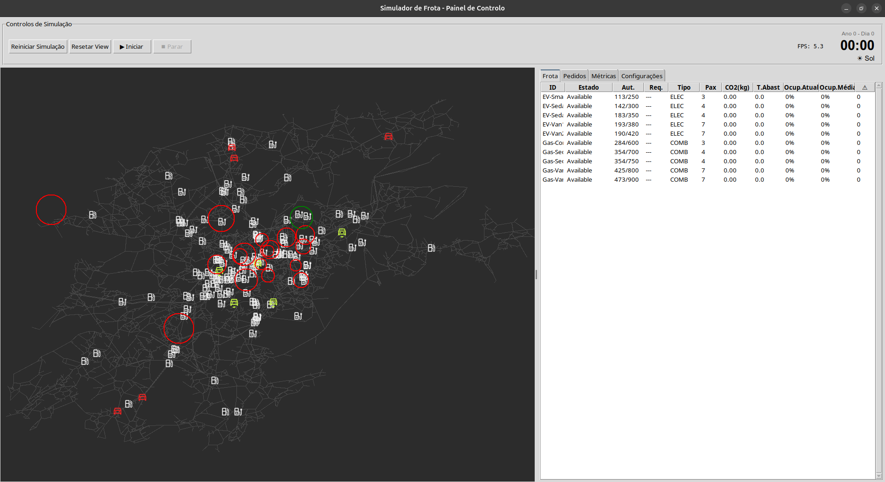
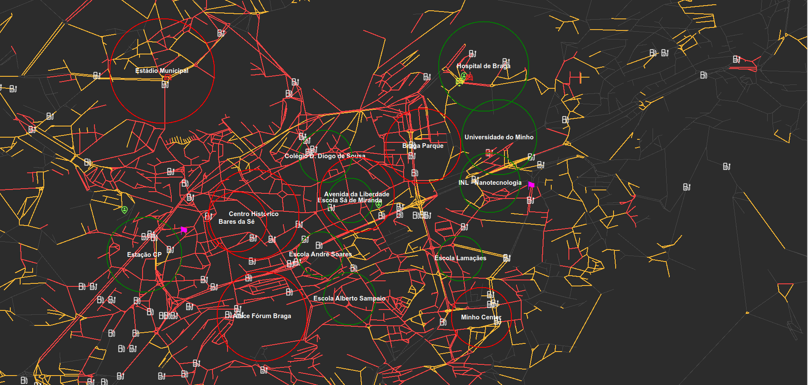
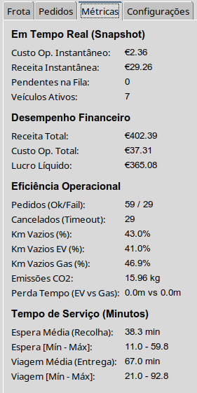
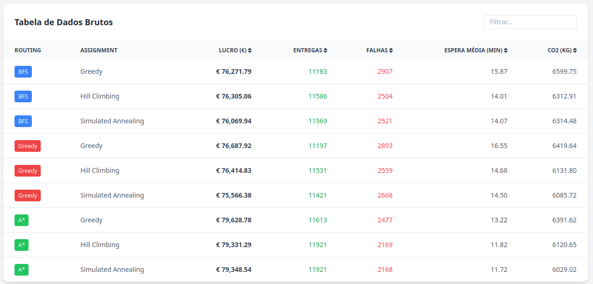

<div align="center">
  <h1>Fleet Simulator: UMINHO AI 25/26</h1>
  <p><strong>A comprehensive fleet simulation for analyzing EVs and Gas vehicles in urban environments.</strong></p>

  [](https://opensource.org/licenses/MIT)
  [](https://www.python.org/)
  [](https://docs.python.org/3/library/tkinter.html)
  [](https://gdal.org/)
</div>

**Fleet Simulator** is a desktop application developed for the Artificial Intelligence class (Maio, 2026) at Universidade do Minho. It provides a robust environment to simulate and optimize fleet operations, comparing the efficiency and environmental impact of Electric Vehicles (EVs) versus Gas Vehicles using real-world map data.

## Overview

We built this project to simulate and analyze the complexities of urban fleet management. **Fleet Simulator** models traffic conditions, hotspot demands, charging/fueling logistics, and vehicle dispatching. It demonstrates how AI strategies can be used to optimize routes and manage a mixed fleet of vehicles efficiently across large city maps (e.g., Braga).

## Screenshots

<p align="center">
  
  
</p>
<p align="center">
  
  
</p>

## Key Features

### Realistic Map Data
- **GDAL Integration:** Uses real-world mapping data caching for node generation, edge mapping, and realistic coordinate systems.

### Dynamic Fleet Simulation
- **Mixed Fleet Engine:** Models both Electric Vehicles (EVs) and Gas Vehicles, natively handling battery/fuel constraints and charging speeds.
- **Traffic & Hotspots:** Simulates varying traffic conditions and demand hotspots that shift dynamically throughout the day.

### Advanced Dispatching
- **AI Routing:** Assigns pending ride requests and manages dynamic routing based on changing environments.
- **Station Management:** Simulates charging station usage, queuing, and unexpected stochastic station failures.

## Tech Stack

The project was built using:

### **Application & Simulation Engine**
- **Language:** [Python](https://www.python.org/)
- **GUI Framework:** Tkinter for displaying vehicle metrics, map views, and weather states.
- **Geographic Data:** GDAL (native C Library dependency).
- **Data Handling:** Custom simulation engine with deterministic and stochastic components, tracking detailed continuous simulation stats.

## The Team

Fleet Simulator was created by:

| Member | Institution | Role / Study Area |
| :--- | :--- | :--- |
| **[Herculano Esteves](https://github.com/Herculano-Esteves)** (a107293) | Universidade do Minho | Software Engineering |
| **[Nuno Fernandes](https://github.com/nunom27)** (a107317) | Universidade do Minho | Software Engineering |
| **[Salomé Faria](https://github.com/faria-s)** (a108487) | Universidade do Minho | Software Engineering |
| **[Tiago Alves](https://github.com/Tiagohvv)** (a106883) | Universidade do Minho | Software Engineering |

## Getting Started

Follow these instructions to set up the project locally.

### Prerequisites
- **Python 3.9+**
- **GDAL (C Library)**: Must be installed natively on your system (e.g., `sudo apt-get install gdal-bin libgdal-dev` on Ubuntu/Debian).

### 1. Clone the Repository
```bash
git clone https://github.com/Herculano-Esteves/AI-25-26.git
cd AI-25-26
```

### 2. Setup Environment
```bash
# Create a virtual environment
python -m venv venv

# Activate the virtual environment
# On Linux/MacOS:
source venv/bin/activate
# On Windows:
# venv\Scripts\activate

# Install python dependencies
pip install -r requirements.txt
```

### 3. Run the Simulation
Launch the primary GUI and simulation engine.
```bash
python main.py
```

## License

This project is licensed under the **MIT License** - see the [LICENSE](LICENSE) file for details (if applicable).
